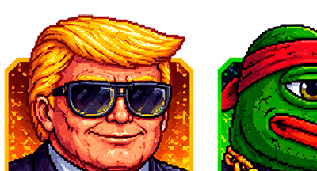
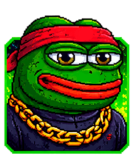
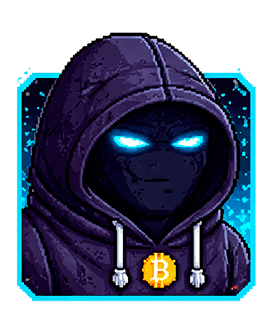

# Factions

## Overview

Three powerful factions control different parts of the city. Each has their own headquarters, guards, vehicles, and missions. Your relationship with each faction is tracked by the **Respect Meter** visible in the top-left corner of the HUD.

## The Three Factions

---

### Trumpet Family

<figure><figcaption></figcaption></figure>

The Trumpet Family is an old-school crime syndicate that rules through brute force and intimidation. Their boss is a loud, gold-obsessed kingpin who demands absolute loyalty. They drive the fastest faction vehicles in the city and their guards are known for shooting first and asking questions never.

| | |
|---|---|
| **Color** | Gold / Yellow |
| **Vehicle** | Trumpet Car — gold, fast, and flashy |
| **HQ** | Fortified compound with gold-themed decor |
| **Specialty** | Speed and aggression |

---

### Pepe Syndicate

<figure><figcaption></figcaption></figure>

The Pepe Syndicate is a mysterious underground network of meme lords turned crime bosses. They operate in the shadows, pulling strings behind the scenes. Nobody knows who their true leader is — only that crossing them is a fatal mistake. Their green vehicles blend into the city until it's too late.

| | |
|---|---|
| **Color** | Green |
| **Vehicle** | Pepe Car — green and inconspicuous |
| **HQ** | Hidden compound with green markings |
| **Specialty** | Stealth and cunning |

---

### The Satoshi Order

<figure><figcaption></figcaption></figure>

The Satoshi Order is a tech-savvy faction that controls the city's digital infrastructure. They run mining farms, hack police databases, and believe that code is the ultimate power. Their members are hooded figures who speak in cryptographic riddles and fight with calculated precision.

| | |
|---|---|
| **Color** | Blue |
| **Vehicle** | Satoshi Car — blue and high-tech |
| **HQ** | Fortified compound near their mining operations |
| **Specialty** | Technology and mining |

---

## Respect System

Your respect with each faction ranges from **-100** to **+100**. Completing missions for a faction increases your respect with them but may decrease it with their rivals.

- **Positive respect**: The faction is friendly toward you
- **Zero respect**: Neutral — they ignore you
- **Negative respect**: The faction considers you an enemy

The Respect Meter in the HUD shows three bars (one per faction) with faction icons. Positive respect fills to the right in the faction's color, negative respect fills to the left in red.

## Faction HQs

Each faction has a fortified headquarters with:
- **Perimeter walls** protecting the compound
- **Armed guards** that patrol the area
- **Faction vehicles** parked nearby
- **Phone booth** to receive mission assignments

Guards will only attack you during active faction missions against their gang. You can safely approach any HQ to use the phone booth and request missions.

## Phone Booths

To start a faction mission, approach the phone booth at a faction HQ and press **F**. The faction boss will give you your assignment through a phone conversation displayed on screen.

Each faction offers unique missions. Once completed, a mission cannot be replayed.
