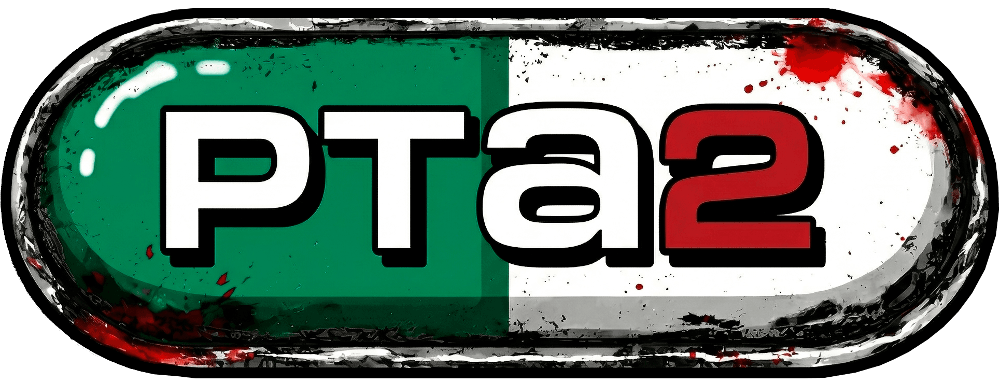

# $PTA2 Token

<figure><figcaption></figcaption></figure>

## Overview

$PTA2 is the native token of Pump Theft Auto 2, built on the Solana blockchain. It bridges the in-game economy with real crypto, allowing players to earn, trade, and cash out.

## How It Works

### Exchange Rate

**1 $PTA2 = 1 in-game cash**

### Opening the Swap Panel

The **⇄ SWAP** button sits in the top-right corner of the HUD, immediately to the right of your cash balance. It is visible to everyone — guests will be prompted to connect their Phantom wallet when they try to swap.

### Buy Cash (Deposit)

Send $PTA2 tokens from your Phantom wallet to the game treasury and receive in-game cash instantly.

1. Click the **⇄ SWAP** button in the top-right of the HUD
2. Select the **$PTA2 → CASH** tab
3. Enter the amount of $PTA2 to spend
4. Confirm the transaction in your Phantom wallet
5. In-game cash is credited immediately after on-chain verification

### Cash Out (Withdraw)

Convert your in-game earnings back to $PTA2 tokens.

1. Click the **⇄ SWAP** button in the top-right of the HUD
2. Select the **CASH → $PTA2** tab
3. Enter the amount of in-game cash to convert
4. The equivalent $PTA2 is sent to your connected wallet

### Limits

| Parameter | Value |
|-----------|-------|
| Minimum swap | 1,000 $PTA2 |
| Maximum swap | 100,000 $PTA2 |
| Cooldown between swaps | 30 seconds |

## Wallet Connection

To use $PTA2 features, you need a **Phantom wallet** browser extension:

1. Install [Phantom](https://phantom.app) in your browser
2. On the Pump Theft Auto 2 main menu, click **CONNECT PHANTOM**
3. Approve the connection in Phantom
4. Your wallet is now linked and you can use the **⇄ SWAP** button to deposit or cash out

## Earning $PTA2

All in-game cash can be converted to $PTA2. Ways to earn cash:

- Complete faction missions ($500 - $800 per mission)
- Drive taxis (fare-based income)
- Complete kill missions (skull pickups)
- Win at the casino (Slots, Roulette, Blackjack)
- Loot cash drops from defeated NPCs

## Tokenomics

| Allocation | Share | Amount | Purpose | Wallet |
|------------|-------|--------|---------|--------|
| Public (Fair Launch) | 85% | 850,000,000 | Available on Pump.fun from day one | — |
| Developer | 10% | 100,000,000 | Project development and maintenance | [Solscan](https://solscan.io/account/EbT6fwutQ5XM94wu7AYapvBbHAdTwaVik18VaGH3GrT3) |
| Treasury | 5% | 50,000,000 | In-game token-to-cash swaps and liquidity | [Solscan](https://solscan.io/account/DtwXGTEimdSupTurpGTCmVami1xMpyBLEfTr6Lb5BnWd) |

- **Total Supply**: 1,000,000,000 $PTA2 (fixed, no minting)
- **Circulating Supply**: 100% from day one — all tokens are unlocked at launch
- The **Treasury** wallet is used exclusively to fund the in-game swap system, allowing players to exchange $PTA2 for in-game cash and vice versa

## Token Details

| Property | Value |
|----------|-------|
| Name | $PTA2 |
| Network | Solana |
| Total Supply | 1,000,000,000 (fixed) |
| Circulating Supply | 100% from day one |
| Launch | Fair launch on Pump.fun |
| Decimals | 6 |
